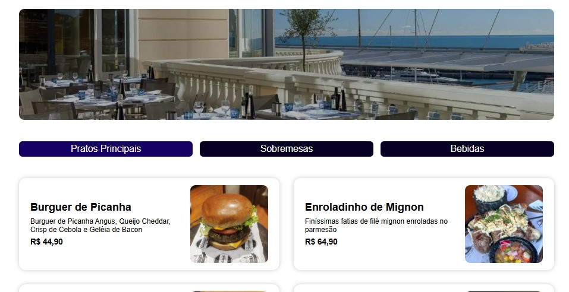

# Projeto Cardápio Digital

Esta pasta contém o código de uma página de cardápio dinâmica feita com react. A pagina exibe um banner, um menu para a escolha de tipos de comidas, e cards exibindo os diferentes pratos. Observe o resultado final abaixo:



## Como rodar:

Para rodar essa página com react, você precisa ter o Node.js instalado em sua máquina.

### Clonando o repositório 

Clone este repositório com o sequinte comando:

```bash
git clone git@github.com:Souzzaturr/arturo-arts.git
```

### Acessando diretório do projeto

Use o seguinte comando para acessar o diretório do projeto:

```bash
cd arturo_arts/coisas_daoras/cardapio-digital/hastaurant
```

### Instalando dependencias

Para instalar as dependencias, se você já está dentro da pasta "hastaurant", apenas utilize o comando abaixo:

```bash
npm install
```

### Iniciando a aplicação

Para iniciar a aplicação, como essa aplicação foi criada com o Vite, iremos utilizar o comando abaixo, no mesmo diretório onde você instalou as dependências. Seque o comando:

```bash
npm run dev
```

Após você rodar esse comando, muito provavelmente a aplicação já vai estar no ar, é só entrar em um link que irá aparecer no terminal (algo parecido com "http://localhost:3000"), que você será redirecionado para seu navegador principal, onde irá estar rodando esse cardápio.

---

enjoy 😎🤙