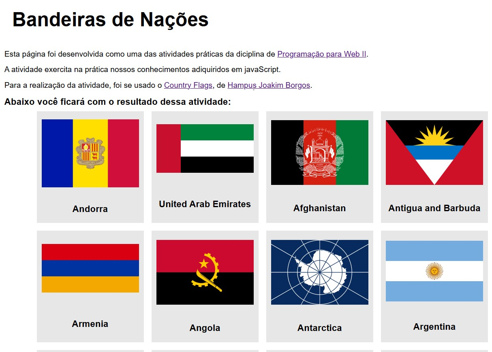

# Bandeiras

Esta página foi desenvolvida como uma das atividades práticas da diciplina de Programação para Web II, do curso de Engenharia de Software do IFPB. A atividade exercita na prática nossos conhecimentos adiquiridos em javaScript. Para a realização da atividade, foi se usado o conjunto de imagens svg onde cada imagem é a bandeira de um país, do repositório Country Flags, de Hampus Joakim Borgos.
Veja o resultado abaixo:

